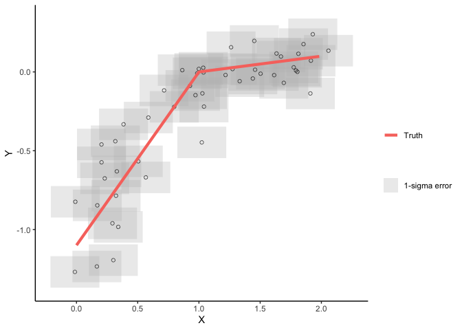
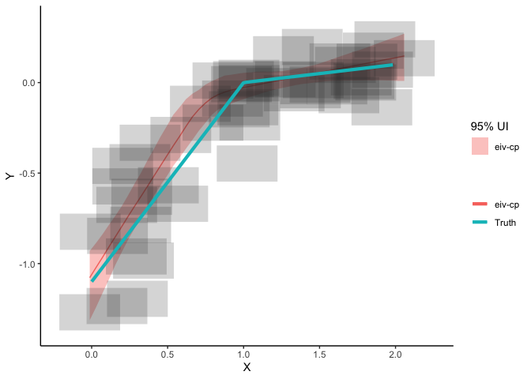
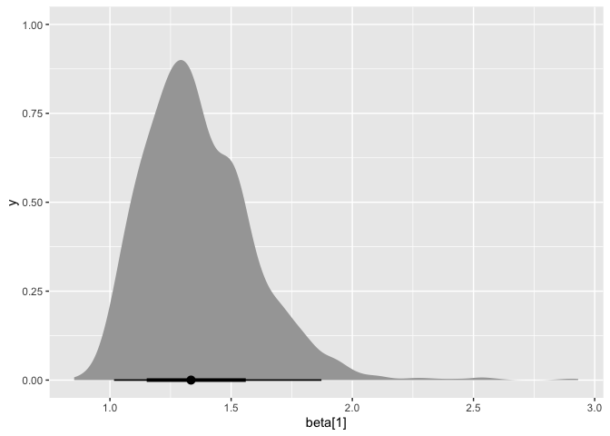
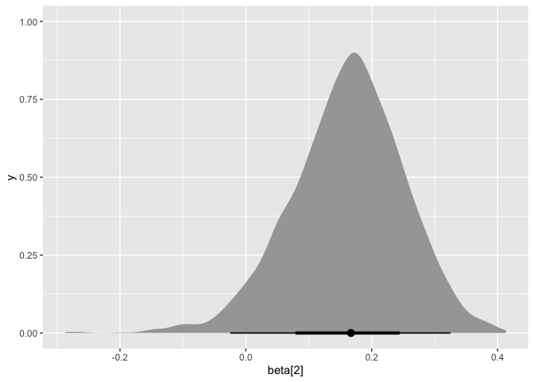
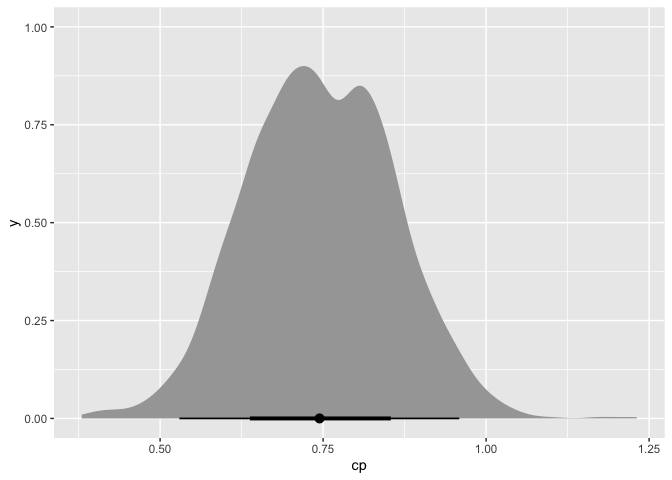
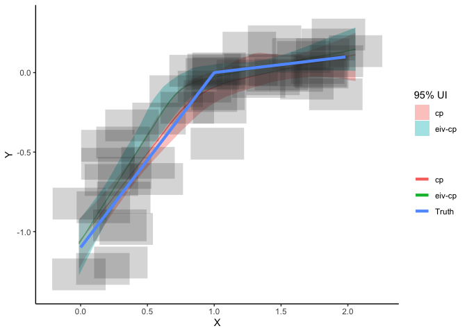

Bayesian Errors-in-Variables Change-Point Linear Regression
================

## Introduction

Here I am going to give you a starting point for fitting a Bayesian
errors-in-variables, change-point regression model for unevenly spaced
time series data, assuming a single change point and measurement errors.
We’ll start by simulating some data with a known change point and then
we’ll see if the change-point model can detect it.

## Setup

``` r
library(EIVmodels)
```

Later we will use the `ggplot` and `tidybayes` packages, so make sure to
load those too.

``` r
library(tidybayes)
library(ggplot2)
```

## Model specification

When it comes to the model specification recipe, the ingredients are

1.  The **process model**, which relates to the expectation of what’s
    underlying the observed data. The process model will be governed by
    a set of parameters that need to be estimated.

2.  The **data model**, which contains assumptions about how the data
    are generated and incorporates data uncertainty. The data model
    links the observed data to the underlying process.

3.  **Priors**, which contain assumptions about the parameters we are
    estimating. Priors can be used to impose constraints on model
    parameters based on apriori information.

**process model**

For our specification, we’ll assume that the expected value of our
observed outcome, $y$, has a changing linear relationship with the
expected x, $\mu_x$, such that

$\mu_y = \alpha + \beta_1(\mu_x - cp) \hspace{2em} \text{for } \mu_x < cp$

$\mu_y = \alpha + \beta_2(\mu_x - cp) \hspace{2em} \text{for } \mu_x \geq cp$

In other words, the linear relationship between $\mu_x$ (the expected
value of x) and $mu_y$ changes at some time point (cp). The measurements
of $x$ are related to $\mu_x$ via a normal distribution

$x \sim N(\mu_x,x_{err}^2)$

where $x_{err}$ are the observed measurement errors.

-   Note, by subtracting the change point (cp) from $\mu_x$ in the
    regression equation we can interpret the intercept ($\alpha$) as
    being the expected value of y at the point where the change point
    occurs.

**data model**

We’ll link the observations to the process through a normal data model.

$y \sim N(\mu_y, \sigma^2)$

If we have measurement error for the ys here, which we’ll call
$y_{err}$, then we can update the data model to be

$y \sim N(\mu_y, \sigma^2 + y_{err}^2)$

**priors**

We need priors for all unknown parameters. The prior on the change point
should constrain the change point to occur somewhere within the range of
the observation years.

If you are interested in digging deeper in to the model specification,
here is the JAGS specification for this particular model, otherwise feel
free to ignore this next part and move straight to the [Simulate
data](#simulate-data) section.

``` r
cp_model <-
'model{

  ## data model
    for(j in 1:n_obs)
  {
  y[j]~dnorm(mu_y[j],tau[j])
  mu_y[j] <- alpha + beta[C[j]]*(mu_x[j]-cp)
  C[j] <- 1+step(mu_x[j]-cp)
  
  x[j] ~ dnorm(mu_x[j],x_err[j]^-2)
  mu_x[j] ~ dnorm(0,0.5^-2)
  
  tau[j] <- (y_err[j]^2 + sigma^2)^-1
  }

  ##Priors
  alpha[1] ~ dnorm(0.0,10^-2)

  beta[1]~dnorm(0.0,10^-2)
  beta[2]~dnorm(0.0,10^-2)

  sigma ~ dt(0,4^-2,1)T(0,)

  cp ~ dunif(x_min,x_max)

  for(i in 1:n_pred)
  {
  mu_pred[i] <-alpha + beta[Cstar[i]]*(x_pred[i]-cp)
  Cstar[i] <- 1+step(x_pred[i]-cp)
  }
}
'
```

**Notes on the model setup:**

-   This setup makes use of the step function in JAGS to decide if
    $\beta_1$ or $\beta_2$ is required, where step(x) = 1 if $x\geq 0$
    and 0 otherwise.

-   Normal distributions in JAGS are always specified with a precision
    parameter where precision = 1/variance.

-   I’ve add in a prediction step in the JAGS model to get model-based
    predictions for a grid of x values ($x_{pred}$).

## Simulate data

One of the best ways to get a feel for a model and it’s limitations is
to use simulations. We can use the `EIVmodels` package to simulate data,
with measurement errors, that has a single change point. Below I’m
simulating 50 data points where x ranges from 0 to 2 (by default), the
change point occurs at a value of $x = 1$, the slope = 1.1 before the
change point ($\beta_1$) and 0.1 after the change point ($\beta_2$) .
The measurement errors for $y$ and $x$ are set to 0.1 and 0.2
respectively.

``` r
cp_dat <- sim_cp(n_sim = 50,
                 alpha = 0,
                 beta = c(1.1,0.1),
                 cp = 1,
                 y_err = 0.1,
                 x_err = 0.2)
cp_dat
```

    ## # A tibble: 50 × 6
    ##        x x_err         y y_err   true_y true_x
    ##    <dbl> <dbl>     <dbl> <dbl>    <dbl>  <dbl>
    ##  1 1.04    0.2  0.0263     0.1  0.0400   1.40 
    ##  2 2.06    0.2  0.135      0.1  0.0953   1.95 
    ##  3 1.61    0.2 -0.0203     0.1  0.0386   1.39 
    ##  4 1.27    0.2  0.0182     0.1  0.0153   1.15 
    ##  5 1.85    0.2  0.176      0.1  0.0926   1.93 
    ##  6 1.81    0.2  0.115      0.1  0.0772   1.77 
    ##  7 1.22    0.2 -0.0197     0.1  0.00125  1.01 
    ##  8 0.715   0.2 -0.117      0.1 -0.229    0.792
    ##  9 1.02    0.2 -0.447      0.1 -0.393    0.643
    ## 10 1.80    0.2  0.000764   0.1  0.0875   1.87 
    ## # … with 40 more rows

The output data will contain the simulated $x$, $y$ data as well as the
measurement errors that were supplied. It will also contain the “true”
underlying process, which can be used for comparison purposes later.
Here’s where you can play around with the simulation by changing the
parameter values to get different datasets with varying characteristics.

Now, plot the simulated data and add the true underlying process that
generated $y$. When we fit the change-point regression model we are
trying to estimate the “Truth” line.

``` r
plot_dat(cp_dat,
         add_truth = TRUE)
```

<!-- -->

## Run the EIV 1-change-point regression model

Now we’re going to pretend that our simulated data is real life data
(i.e., we don’t know the parameter values). So we want to run the model
and estimate the parameters. We can then compare the true values of the
parameters to the posterior distribution for the parameters to see how
the model performs.

We can use the `EIVmodels` package to fit an EIV change-point regression
model using the `run_mod` function. Specify the model argument as
\`model = “cp”.

``` r
mod_eiv_cp <- run_mod(cp_dat,
                      model = "cp")
```

    ## module glm loaded

    ## Compiling model graph
    ##    Resolving undeclared variables
    ##    Allocating nodes
    ## Graph information:
    ##    Observed stochastic nodes: 100
    ##    Unobserved stochastic nodes: 55
    ##    Total graph size: 924
    ## 
    ## Initializing model

    ## No convergence issues detected

## Results

We can plot the results (and add the true line) using the `plot_res`
function as follows:

``` r
plot_res(mod_eiv_cp,
         add_truth = TRUE)
```

<!-- -->

To access the parameter summaries from the model we need to run the
`par_est` function.

``` r
mod_cp_res <- par_est(mod = mod_eiv_cp)
mod_cp_res$par_summary
```

    ## # A tibble: 5 × 10
    ##   variable    mean  median     sd    mad       q5    q95  rhat ess_bulk ess_tail
    ##   <chr>      <dbl>   <dbl>  <dbl>  <dbl>    <dbl>  <dbl> <dbl>    <dbl>    <dbl>
    ## 1 alpha    -0.0712 -0.0710 0.0690 0.0674 -0.182   0.0402 1.00      986.     955.
    ## 2 beta[1]   1.37    1.33   0.234  0.214   1.06    1.78   1.00      975.     942.
    ## 3 beta[2]   0.162   0.169  0.0898 0.0833  0.00745 0.298  1.00     1009.     833.
    ## 4 cp        0.747   0.749  0.114  0.121   0.570   0.926  0.999     961.     906.
    ## 5 sigma     0.0337  0.0287 0.0247 0.0252  0.00268 0.0799 1.00     1031.     941.

In this summary, q5 and q95 provide the upper and lower bounds of the
90% uncertainty intervals. Note here whether or not the 90% uncertainty
intervals contain the true parameter values.

If you would like to get a more detailed look at the posterior
distributions for the parameters you can pull the posterior samples from
the model object created above and we can use the `tidybayes` package to
create some plots.

First, get the `sample_draws` which contains the posterior samples for
the parameters and the model-based estimates for the expected value of
y.

``` r
mod_eiv_cp$sample_draws
```

    ## # A tibble: 3,000 × 59
    ##    .chain .iteration .draw   alpha beta[…¹ beta[…²    cp devia…³ mu_pr…⁴ mu_pr…⁵
    ##     <int>      <int> <int>   <dbl>   <dbl>   <dbl> <dbl>   <dbl>   <dbl>   <dbl>
    ##  1      1          1     1 -0.0492    1.48  0.118  0.685  -103.   -1.08   -1.02 
    ##  2      1          2     2 -0.0537    1.16  0.110  0.796   -90.2  -0.994  -0.945
    ##  3      1          3     3 -0.185     1.47  0.302  0.572   -80.3  -1.04   -0.980
    ##  4      1          4     4 -0.0344    1.21  0.114  0.819   -89.9  -1.04   -0.992
    ##  5      1          5     5 -0.0403    1.30  0.147  0.732   -91.6  -1.01   -0.952
    ##  6      1          6     6 -0.0345    1.51  0.100  0.738   -68.7  -1.17   -1.11 
    ##  7      1          7     7 -0.129     1.33  0.236  0.703   -75.8  -1.08   -1.02 
    ##  8      1          8     8  0.0328    1.30  0.0260 0.881   -96.8  -1.13   -1.07 
    ##  9      1          9     9 -0.107     1.54  0.184  0.678   -74.2  -1.17   -1.11 
    ## 10      1         10    10 -0.248     1.59  0.378  0.500   -60.4  -1.06   -0.996
    ## # … with 2,990 more rows, 49 more variables: `mu_pred[3]` <dbl>,
    ## #   `mu_pred[4]` <dbl>, `mu_pred[5]` <dbl>, `mu_pred[6]` <dbl>,
    ## #   `mu_pred[7]` <dbl>, `mu_pred[8]` <dbl>, `mu_pred[9]` <dbl>,
    ## #   `mu_pred[10]` <dbl>, `mu_pred[11]` <dbl>, `mu_pred[12]` <dbl>,
    ## #   `mu_pred[13]` <dbl>, `mu_pred[14]` <dbl>, `mu_pred[15]` <dbl>,
    ## #   `mu_pred[16]` <dbl>, `mu_pred[17]` <dbl>, `mu_pred[18]` <dbl>,
    ## #   `mu_pred[19]` <dbl>, `mu_pred[20]` <dbl>, `mu_pred[21]` <dbl>, …

Now let’s look at the posterior distributions for $\beta_1$ and
$\beta_2$ and the change-point (cp). We’ll use the `stat_halfeye()`
function from the `tidybayes` package.

``` r
ggplot(mod_eiv_cp$sample_draws, aes(x = `beta[1]`)) +
  tidybayes::stat_halfeye() 
```

<!-- -->

``` r
ggplot(mod_eiv_cp$sample_draws, aes(x = `beta[2]`)) +
  tidybayes::stat_halfeye() 
```

<!-- -->

``` r
ggplot(mod_eiv_cp$sample_draws, aes(x = cp)) +
  tidybayes::stat_halfeye() 
```

<!-- -->

## What if we didn’t assume the EIV component in the model?

If you wish the ignore the EIV component in the change-point model then
you can use the `run_mod` function from the `EIVmodels` package and
specify `EIV = FALSE`.

``` r
mod_cp <- run_mod(cp_dat,
                  model = "cp",
                  EIV = FALSE)
```

    ## Compiling model graph
    ##    Resolving undeclared variables
    ##    Allocating nodes
    ## Graph information:
    ##    Observed stochastic nodes: 50
    ##    Unobserved stochastic nodes: 5
    ##    Total graph size: 809
    ## 
    ## Initializing model

    ## No convergence issues detected

We can then compare both models to the truth.

``` r
plot_res(mod_cp,
         mod_eiv_cp,
         add_truth = TRUE)
```

<!-- -->

## Summary

This is a starting point for developing Bayesian change-point regression
models for time dependent data with measurement error. Using simulated
data can be helpful for checking if the model is doing what you expect
it to do.
