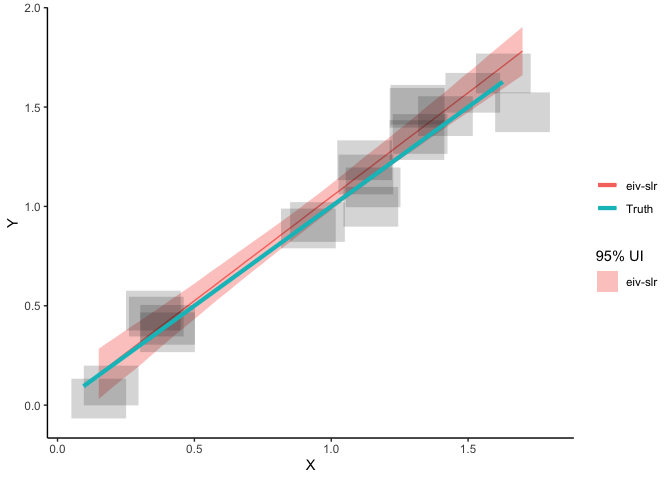

Introduction to EIVmodels
================

EIVmodels is a R package designed specifically to account for
measurement errors within some commonly used models (linear regression,
change-point regression, (Integrated) Gaussian process regression) when
analysing time-dependent data derived from paleoenvironmental
reconstructions.

## Setup

``` r
library(EIVmodels)
```

## Example - Simple Linear Regression

This package provides options to simulate data from different types of
models where there is measurement error in both the `x` and `y`
variable. We’ll start by simulating some data from a linear regression
model with measurement error. The default range for $x$ is 0 to 2. I’m
simulating 20 data points where the intercept ($\alpha$) = 0, slope
($\beta$) = 1. The measurement errors for $y$ and $x$ are set to 0.1.

``` r
dat <- sim_slr(n_sim = 20,
               alpha = 0,
               beta = 1,
               y_err = 0.1,
               x_err = 0.1)
dat
```

    ## # A tibble: 20 × 6
    ##        x x_err      y y_err true_y true_x
    ##    <dbl> <dbl>  <dbl> <dbl>  <dbl>  <dbl>
    ##  1 1.63    0.1 1.67     0.1 1.63   1.63  
    ##  2 1.32    0.1 1.51     0.1 1.41   1.41  
    ##  3 1.31    0.1 1.33     0.1 1.33   1.33  
    ##  4 0.402   0.1 0.404    0.1 0.372  0.372 
    ##  5 0.950   0.1 0.921    0.1 1.06   1.06  
    ##  6 1.42    0.1 1.45     0.1 1.51   1.51  
    ##  7 1.32    0.1 1.36     0.1 1.24   1.24  
    ##  8 1.12    0.1 1.23     0.1 1.12   1.12  
    ##  9 1.31    0.1 1.50     0.1 1.41   1.41  
    ## 10 0.350   0.1 0.476    0.1 0.447  0.447 
    ## 11 1.15    0.1 1.10     0.1 1.18   1.18  
    ## 12 1.14    0.1 0.998    0.1 0.989  0.989 
    ## 13 0.151   0.1 0.0330   0.1 0.150  0.150 
    ## 14 1.13    0.1 1.16     0.1 1.14   1.14  
    ## 15 0.917   0.1 0.889    0.1 0.845  0.845 
    ## 16 1.70    0.1 1.47     0.1 1.57   1.57  
    ## 17 1.52    0.1 1.57     0.1 1.52   1.52  
    ## 18 0.402   0.1 0.367    0.1 0.309  0.309 
    ## 19 0.196   0.1 0.0987   0.1 0.0948 0.0948
    ## 20 0.361   0.1 0.445    0.1 0.504  0.504

The output data contains the simulated $x$, $y$ data as well as the
measurement errors that were supplied. It will also contain the “true”
underlying process, which can be used for comparison purposes later.

Next we’ll plot the simulated data and we’ll add the true regression
line to the plot by adding the argument `add_truth = TRUE` to the
`plot_dat()` function.

``` r
plot_dat(dat,
         add_truth = TRUE)
```

<!-- -->

Now we’ll fit the errors-in-variables simple linear regression model to
the data and see how close we get to estimating the true data generating
process. We’ll start by creating a model object and specifying the
argument `model = "slr"`. You’ll see some messages and a progress bar
pop up as the JAGS model starts to run.

``` r
mod_eiv_slr <- run_mod(dat,
                       model = "slr")
```

    ## module glm loaded

    ## Compiling model graph
    ##    Resolving undeclared variables
    ##    Allocating nodes
    ## Graph information:
    ##    Observed stochastic nodes: 40
    ##    Unobserved stochastic nodes: 23
    ##    Total graph size: 310
    ## 
    ## Initializing model

    ## No convergence issues detected

Now we’ll plot the model-based estimates with uncertainty. We’ll overlay
the “true” line as a comparison.

``` r
plot_res(mod_eiv_slr,
         add_truth = TRUE)
```

<!-- -->

To access the data that created this plot, use:

``` r
mod_reg_res <- par_est(mod = mod_eiv_slr)
mod_reg_res$pred_summary
```

    ## # A tibble: 50 × 4
    ##        x pred_y lwr_95 upr_95
    ##    <dbl>  <dbl>  <dbl>  <dbl>
    ##  1 0.151  0.160 0.0349  0.276
    ##  2 0.182  0.192 0.0707  0.305
    ##  3 0.214  0.225 0.108   0.334
    ##  4 0.245  0.259 0.145   0.363
    ##  5 0.277  0.292 0.180   0.393
    ##  6 0.309  0.325 0.215   0.423
    ##  7 0.340  0.358 0.251   0.454
    ##  8 0.372  0.391 0.288   0.485
    ##  9 0.403  0.425 0.324   0.515
    ## 10 0.435  0.458 0.358   0.545
    ## # … with 40 more rows

To access a summary of the parameter estimates, use:

``` r
mod_reg_res$par_summary
```

    ## # A tibble: 3 × 10
    ##   variable     mean  median     sd    mad       q5   q95  rhat ess_bulk ess_tail
    ##   <chr>       <dbl>   <dbl>  <dbl>  <dbl>    <dbl> <dbl> <dbl>    <dbl>    <dbl>
    ## 1 alpha    -0.00258 0.00270 0.0743 0.0740 -0.118   0.116 1.00     1041.     907.
    ## 2 beta      1.05    1.05    0.0707 0.0689  0.936   1.17  1.00     1006.    1015.
    ## 3 sigma     0.0425  0.0351  0.0332 0.0320  0.00308 0.106 0.999    1123.    1112.

## Example - Using real data

The package contains a dataset called `NJ_CC` which is subset of a sea
level reconstruction from New Jersey, USA (details of the full record
can be found in [this
paper](https://cp.copernicus.org/articles/12/525/2016/)). Note the
format of the dataset. This is the format you should use for any data
you want to apply these models to.

``` r
EIVmodels::NJ_CC
```

    ## # A tibble: 50 × 4
    ##        x     y y_err x_err
    ##    <dbl> <dbl> <dbl> <dbl>
    ##  1  1509 -1.13  0.08  21  
    ##  2  1521 -1.12  0.07  20  
    ##  3  1532 -1.1   0.07  19  
    ##  4  1594 -1.05  0.06  15  
    ##  5  1604 -1     0.09  15  
    ##  6  1612 -0.97  0.09  13.5
    ##  7  1645 -0.91  0.13   7.5
    ##  8  1661 -0.91  0.09   6  
    ##  9  1687 -0.88  0.11  11  
    ## 10  1700 -0.85  0.11  11.5
    ## # … with 40 more rows

Let’s plot the data

``` r
plot_dat(NJ_CC)
```

<!-- -->

### EIV simple linear regression

Let’s fit the EIV simple linear regression model. With these data its a
good idea to scale the age data. Dividing my 1000 is useful here, as the
relative sea level data ($y$) is in metres, dividing by 1000 means the
slope (rate of change) is still easily interpreted in relation to the
original scale of the data. In this case the slope can be interpreted in
mm/yr.

``` r
mod_eiv_slr <- run_mod(NJ_CC,
                       model = "slr",
                       scale_factor_x = 1000)
```

    ## Compiling model graph
    ##    Resolving undeclared variables
    ##    Allocating nodes
    ## Graph information:
    ##    Observed stochastic nodes: 100
    ##    Unobserved stochastic nodes: 53
    ##    Total graph size: 582
    ## 
    ## Initializing model

    ## No convergence issues detected

Let’s get the parameter estimates

``` r
mod_reg_res <- par_est(mod = mod_eiv_slr)
mod_reg_res$par_summary
```

    ## # A tibble: 3 × 10
    ##   variable    mean  median     sd    mad       q5     q95  rhat ess_bulk ess_t…¹
    ##   <chr>      <dbl>   <dbl>  <dbl>  <dbl>    <dbl>   <dbl> <dbl>    <dbl>   <dbl>
    ## 1 alpha    -4.10   -4.10   0.198  0.188  -4.45    -3.78   0.999    1038.    894.
    ## 2 beta      1.92    1.92   0.110  0.105   1.75     2.12   0.999    1028.    983.
    ## 3 sigma     0.0169  0.0141 0.0130 0.0127  0.00112  0.0419 1.00      906.    938.
    ## # … with abbreviated variable name ¹​ess_tail

Based on this model, the rate of sea level change is 1.9 mm/yr (90% UI:
1.7 to 2.1 mm/yr)

Now, let’s visualise the results

``` r
plot_res(mod_eiv_slr)
```

<!-- -->

### EIV change-point linear regression

Let’s fit the EIV change point linear regression model instead. All we
need to do is change the model argument to “cp”.

``` r
mod_eiv_cp <- run_mod(NJ_CC,
                       model = "cp",
                       scale_factor_x = 1000)
```

    ## Compiling model graph
    ##    Resolving undeclared variables
    ##    Allocating nodes
    ## Graph information:
    ##    Observed stochastic nodes: 100
    ##    Unobserved stochastic nodes: 55
    ##    Total graph size: 986
    ## 
    ## Initializing model

    ## No convergence issues detected

Let’s get the parameter estimates

``` r
mod_cp_res <- par_est(mod = mod_eiv_cp)
mod_cp_res$par_summary
```

    ## # A tibble: 5 × 10
    ##   variable    mean  median     sd    mad       q5     q95  rhat ess_bulk ess_t…¹
    ##   <chr>      <dbl>   <dbl>  <dbl>  <dbl>    <dbl>   <dbl> <dbl>    <dbl>   <dbl>
    ## 1 alpha    -0.640  -0.653  0.162  0.169  -0.896   -0.383  0.999    1041.    981.
    ## 2 beta[1]   1.40    1.44   0.334  0.296   0.874    1.82   0.999     954.    951.
    ## 3 beta[2]   4.03    3.38   2.20   0.913   2.29     8.09   1.00     1096.    944.
    ## 4 cp        1.85    1.85   0.0734 0.0714  1.72     1.96   0.999    1096.    906.
    ## 5 sigma     0.0150  0.0129 0.0113 0.0108  0.00148  0.0363 0.999     965.    822.
    ## # … with abbreviated variable name ¹​ess_tail

Now, let’s visualise the results

``` r
plot_res(mod_eiv_cp)
```

<!-- -->

### EIV Gaussian Process

Let’s fit the EIV Gaussian process model. This will take longer to run
than the others (about 25 minutes for the `NJ_CC` data). Rates will be
provided with this model but they are approximated using a method of
finite differences. If rates are of interest it is recommended to use
the [EIV Integrated Gaussian Process](#eiv-integrated-gaussian-process)
model instead.

``` r
mod_eiv_gp <- run_mod(NJ_CC,
                       model = "gp",
                       scale_factor_x = 1000)
```

Let’s visualise the results

``` r
plot_res(mod_eiv_gp)
```

    ## $p

<!-- -->

    ## 
    ## $p_rate

<!-- -->

Let’s look at the output that creates these results plots

``` r
mod_gp_res <- par_est(mod = mod_eiv_gp)
mod_gp_res$pred_summary
```

    ## # A tibble: 50 × 7
    ##        x pred_y lwr_95 upr_95 rate_y rate_lwr_95 rate_upr_95
    ##    <dbl>  <dbl>  <dbl>  <dbl>  <dbl>       <dbl>       <dbl>
    ##  1 1509   -1.09  -1.24 -0.932  0.461     -0.969         1.57
    ##  2 1519.  -1.08  -1.23 -0.938  0.481     -0.915         1.58
    ##  3 1529.  -1.08  -1.21 -0.942  0.535     -0.794         1.60
    ##  4 1539.  -1.07  -1.20 -0.945  0.596     -0.685         1.60
    ##  5 1549.  -1.07  -1.19 -0.947  0.639     -0.578         1.63
    ##  6 1559.  -1.06  -1.17 -0.947  0.703     -0.459         1.64
    ##  7 1569.  -1.05  -1.16 -0.946  0.776     -0.333         1.68
    ##  8 1578.  -1.04  -1.15 -0.944  0.836     -0.227         1.71
    ##  9 1588.  -1.04  -1.13 -0.940  0.887     -0.132         1.75
    ## 10 1598.  -1.03  -1.12 -0.935  0.946     -0.0164        1.79
    ## # … with 40 more rows

Let’s check parameter estimates

``` r
mod_gp_res$par_summary
```

    ## # A tibble: 4 × 10
    ##   variable   mean  median     sd    mad       q5    q95  rhat ess_bulk ess_tail
    ##   <chr>     <dbl>   <dbl>  <dbl>  <dbl>    <dbl>  <dbl> <dbl>    <dbl>    <dbl>
    ## 1 alpha    0.352  -0.0352 2.84   1.75   -3.76    5.65   1.00      954.     941.
    ## 2 phi      1.26    1.04   0.799  0.642   0.370   2.95   1.00      812.     940.
    ## 3 sigma    0.0151  0.0122 0.0124 0.0107  0.00114 0.0391 0.999     950.     912.
    ## 4 sigma_g  3.19    2.14   3.19   1.62    0.600   9.32   0.999    1133.     908.

### EIV Integrated Gaussian Process

Let’s fit the EIV integrated Gaussian process model. This is a much
richer model and will also take longer to run than than the simpler
models (\~ 12 minutes for the `NJ_CC` dataset). However, an advantage is
that it provides the underlying rate process directly from the model.
Details of this model can be found in [this
paper](https://projecteuclid.org/journals/annals-of-applied-statistics/volume-9/issue-2/Modeling-sea-level-change-using-errors-in-variables-integrated-Gaussian/10.1214/15-AOAS824.full).

``` r
mod_eiv_igp <- run_mod(NJ_CC,
                       model = "igp",
                       scale_factor_x = 1000)
```

Let’s visualise the results

``` r
plot_res(mod_eiv_igp)
```

    ## $p

<!-- -->

    ## 
    ## $p_rate

<!-- -->

Let’s look at the output that creates these results plots

``` r
mod_igp_res <- par_est(mod = mod_eiv_igp)
mod_igp_res$pred_summary
```

    ## # A tibble: 50 × 7
    ##        x pred_y lwr_95 upr_95 rate_y rate_lwr_95 rate_upr_95
    ##    <dbl>  <dbl>  <dbl>  <dbl>  <dbl>       <dbl>       <dbl>
    ##  1 1509   -1.12  -1.22 -1.03   0.915     -0.113         2.10
    ##  2 1519.  -1.11  -1.20 -1.03   0.942     -0.0477        2.03
    ##  3 1529.  -1.10  -1.18 -1.03   0.975      0.0320        2.03
    ##  4 1539.  -1.09  -1.17 -1.02   1.00       0.0925        1.99
    ##  5 1549.  -1.08  -1.15 -1.02   1.04       0.187         1.97
    ##  6 1559.  -1.07  -1.14 -1.01   1.08       0.257         1.96
    ##  7 1569.  -1.06  -1.12 -1.00   1.11       0.322         1.93
    ##  8 1578.  -1.05  -1.11 -0.995  1.14       0.399         1.92
    ##  9 1588.  -1.04  -1.09 -0.986  1.18       0.482         1.91
    ## 10 1598.  -1.03  -1.08 -0.974  1.21       0.552         1.91
    ## # … with 40 more rows

Let’s check parameter estimates

``` r
mod_igp_res$par_summary
```

    ## # A tibble: 3 × 10
    ##   variable   mean median     sd    mad      q5    q95  rhat ess_bulk ess_tail
    ##   <chr>     <dbl>  <dbl>  <dbl>  <dbl>   <dbl>  <dbl> <dbl>    <dbl>    <dbl>
    ## 1 phi      0.193  0.176  0.102  0.103  0.0547  0.376  0.999     836.    1025.
    ## 2 sigma    0.0153 0.0128 0.0117 0.0115 0.00113 0.0387 0.999    1026.     986.
    ## 3 sigma_g  2.93   2.46   1.97   1.42   0.734   6.76   1.00      840.     909.
